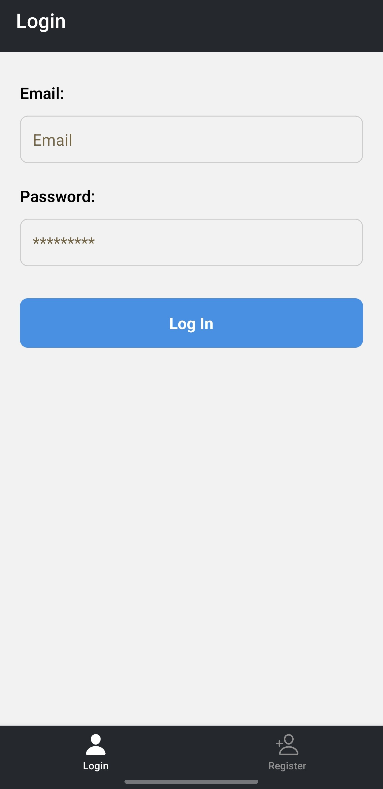
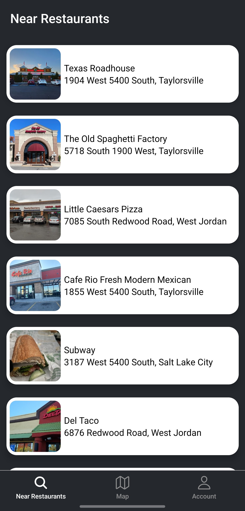
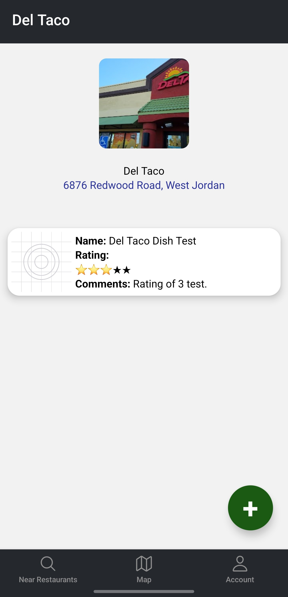
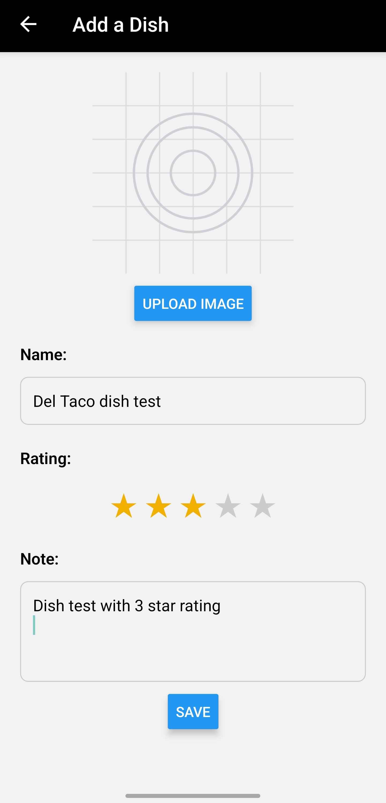
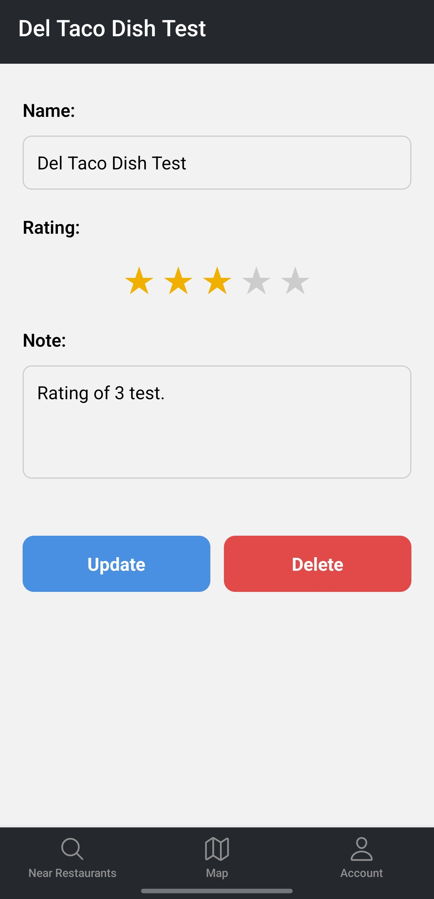
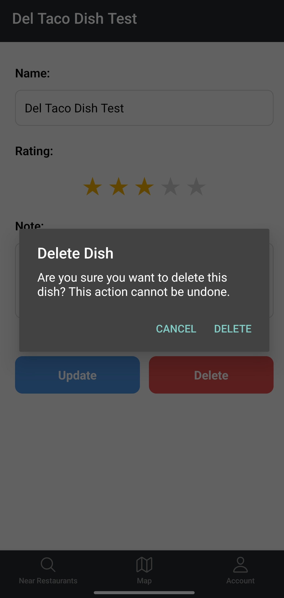
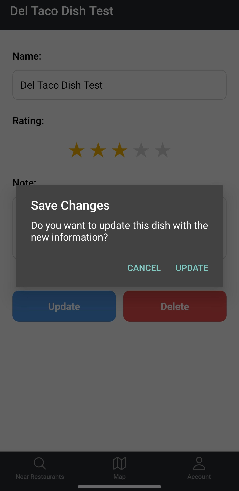
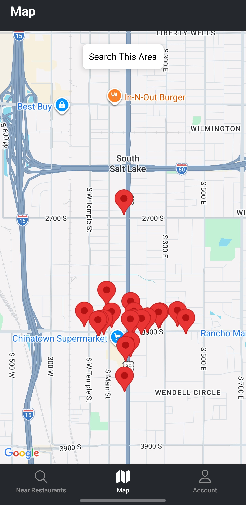
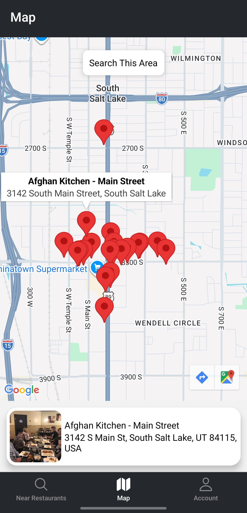
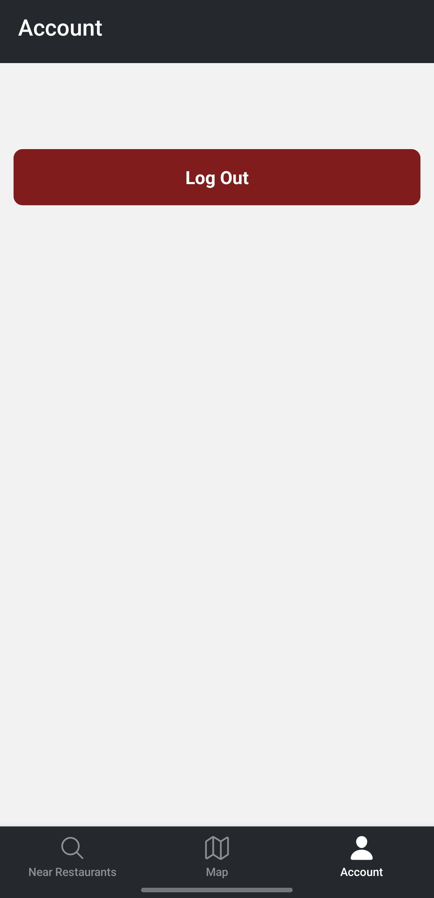

"# NomNom" 
# 🍽️ Nom Nom 
*A React Native + Expo app for remembering the dishes we love (and the ones we don’t).*

NomNom is a mobile app built to solve a simple but universal problem:  
**you try a dish you love… and the next time you visit that restaurant, you can’t remember what it was.**

This app helps my wife and me keep track of the dishes we’ve tried at restaurants around us — what we liked, what we didn’t, and any notes we want to remember for next time. It uses **Supabase** for authentication + database storage and the **Google Maps Places API** to fetch real restaurant data.

---

## ✨ Features

### 🔐 Authentication  
- Email/password login & registration via **Supabase Auth**  
- Secure session handling with persistent login  
- User-specific data storage

### 🍽️ Dish Tracking  
- Add dishes you’ve tried at any restaurant  
- Rate each dish (1–5 stars)  
- Save personal notes (taste, spice level, portion size, etc.)  
- View your full history of dishes per restaurant

### 📍 Restaurant Lookup  
- Search nearby restaurants using **Google Maps Places API**  
- Auto-fill restaurant details when adding a dish  
- See all dishes you’ve logged for a specific place

### ❤️ Personalization  
- Designed for people who want to remember their favorites  
- Clean, simple UI optimized for quick entry while dining out

---

## 🛠️ Tech Stack

| Category | Technology |
|---------|------------|
| Framework | **React Native** (Expo) |
| Backend | **Supabase** (Auth + Postgres DB) |
| Storage | Supabase Tables + Row Level Security |
| APIs | **Google Maps Places API** |
| State | React Hooks / Context |
| Platform | iOS, Android, Expo Go |

---

## 📦 Installation

### 1. Clone the repo
```sh
git clone https://github.com/mcastre1/NomNom.git
cd NomNom
```

### 2. Install dependencies
```sh
npm install
```

### 3. Add environment variables  
Create a `.env` file (or use Expo’s `app.config.js`):

```
EXPO_PUBLIC_SUPABASE_URL=your-url
EXPO_PUBLIC_SUPABASE_ANON_KEY=your-key
EXPO_PUBLIC_GOOGLE_MAPS_API_KEY=your-key
EXPO_PUBLIC_PUBLISH_KEY=your key
```

### 4. Start the app
```sh
npx expo start
```

---

## 🗄️ Database Schema (Supabase)

### `profiles`
| Column | Type | Description |
|--------|------|-------------|
| id | uuid | User ID (auth.uid) |
| updated_at | timestamp |
| username | text |
| full_name | text |
| avatar_url | text |
| website | text |

### `dishes`
| Column | Type |
|--------|------|
| id | uuid |
| user_id | uuid |
| restaurant_id | uuid |
| name | text |
| rating | int |
| notes | text |
| photo | text (link to supabase storage container) |

---

## 📸 Screenshots (optional)
Add these later:
- Login screen 
- Restaurants near 
- Restaurant page 
- Add Dish modal 
- Dish page 
- Remove dish 
- Update Dish 
- Map 
- Map click on POI 
- Logout 


---


## 📄 License
MIT License